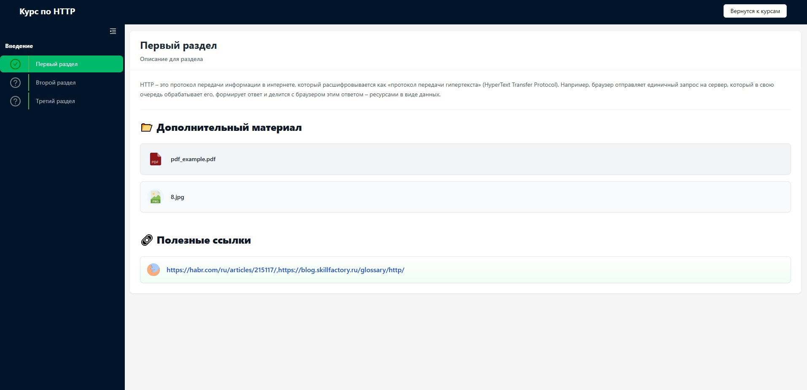
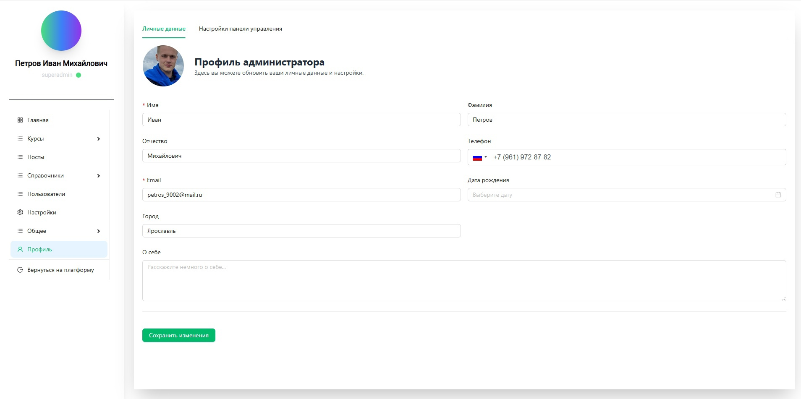

# Learnify

Learnify — это образовательная платформа,находящаяся в стадии активной разработки. Она предлагает широкие возможности для студентов, преподавателей и администраторов, обеспечивая эффективное управление курсами и интерактивное обучение.

---

## Возможности

### Для студентов
- **Запись на курсы**: Изучайте и записывайтесь на разнообразные курсы, подходящие под ваши интересы.
- **Интерактивное обучение**: Работайте с материалами курсов, выполняйте задания и отслеживайте свой прогресс.
- **Удобный интерфейс**: Простая и интуитивно понятная система для комфортного обучения.

### Для преподавателей
- **Создание курсов**: Разрабатывайте и управляйте курсами с помощью удобных инструментов.
- **Управление студентами**: Отслеживайте успехи студентов, общайтесь напрямую и давайте персонализированную обратную связь.
- **Полный контроль**: Модерируйте обсуждения, загружайте ресурсы и управляйте заданиями легко и удобно.

### Для администраторов
- **Контроль платформы**: Следите за активностью, управляйте пользователями и обеспечивайте стабильную работу платформы.
- **Управление ролями пользователей**: Назначайте и изменяйте роли (студент, преподаватель, администратор).
- **Аналитика**: Получайте данные о производительности платформы и вовлеченности пользователей.

---

## Технологический стек

- **Frontend**: 
  - [Next.js](https://nextjs.org/) — фреймворк на базе React для создания быстрых и масштабируемых веб-приложений.
  - [Tailwind CSS](https://tailwindcss.com/) — CSS-фреймворк для быстрой разработки пользовательского интерфейса.
  - [MobX](https://mobx.js.org/) — управление состоянием приложения.
- **Архитектура**:
  - Проект постепенно переносится на архитектуру Feature-Sliced Design (FSD) для улучшения модульности и масштабируемости кода.
---

## Скриншоты приложения

<div style="display: flex; flex-wrap: wrap; justify-content: space-beetwen gap: 20px;">
   
   
   
   
   
   
   
   
   
</div>

## Начало работы
1. Склонируйте репозиторий:
   ```bash
   git clone https://github.com/DevoidBark2/glp-front
   cd glp-front
   ```

2. Установите зависимости:
   ```bash
   npm install
   # или
   yarn install
   # или
   pnpm install
   # или
   bun install
   ```

3. Запустите сервер разработки:
   ```bash
   npm run dev
   # или
   yarn dev
   # или
   pnpm dev
   # или
   bun dev
   ```

4. Откройте [http://localhost:3000](http://localhost:3000) в браузере, чтобы увидеть приложение в действии.
